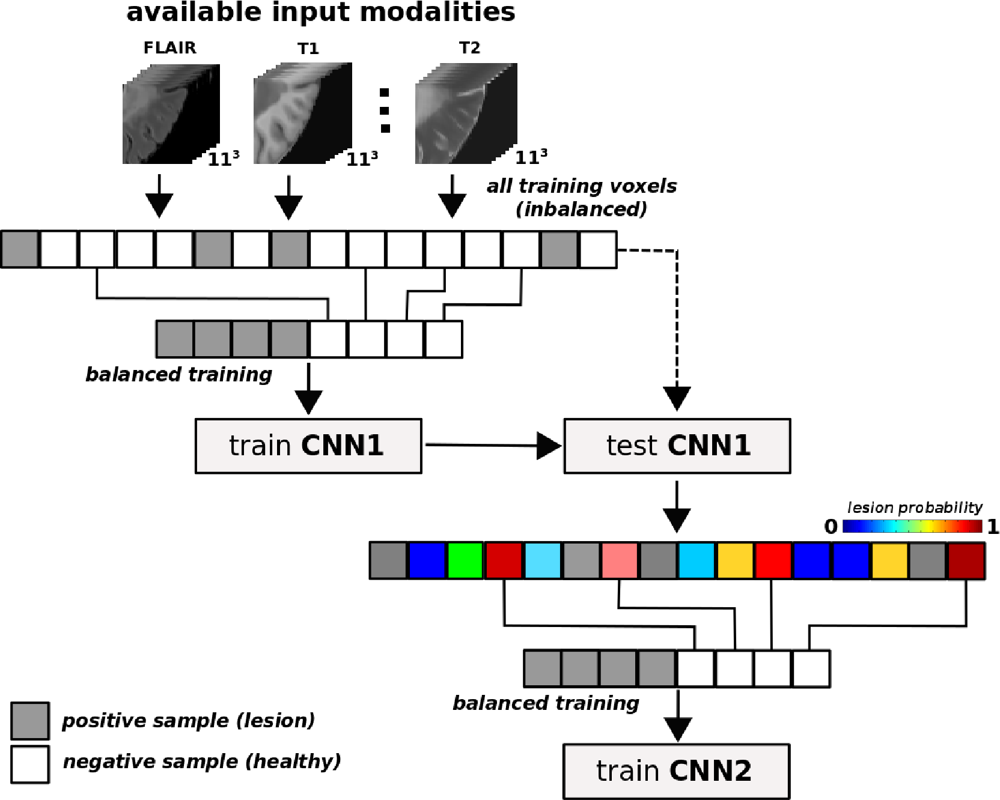

# Multiple Sclerosis (MS) lesion segmentation of MRI images using a cascade of two 3D convolutional neural networks 

This repository implements the method proposed in the [NeuroImage publication](https://doi.org/10.1016/j.neuroimage.2017.04.034), but an electronic preprint is available from [Arxiv](http://arxiv.org/abs/1702.04869):

```
Valverde, S., Cabezas, M., Roura, E., González-Villà, S., Pareto, D., Vilanova, J. C., … Lladó, X. (2017). 
Improving automated multiple sclerosis lesion segmentation with a cascaded 3D convolutional neural network approach. 
NeuroImage, 155, 159–168. https://doi.org/10.1016/j.neuroimage.2017.04.034
``` 

# Overview: 

Convolutional neural networks (CNN) are being increasingly used in brain MRI image analysis for segmentation of brain tumors, tissue or pathological lesions. We have developed a novel Multiple Sclerosis (MS) white matter (WM) lesion segmentation method based on a cascade of two 3D patch-wise convolutional neural networks (CNN). The first network is trained to be more sensitive revealing possible candidate lesion voxels while the second network is trained to reduce the number of misclassified voxels coming from the first network. This cascaded CNN architecture tends to learn well from small sets of training data, which can be very interesting in practice, given the difficulty to obtain manual label annotations and the large amount of available unlabeled MRI data. 

The method accepts a variable number of MRI image sequences for training (T1-w, FLAIR, PD-w, T2-w, ...), which are stacked as channels into the model. However, so far, the same number of sequences have to be used for testing. In contrast to other proposed methods, the model is trained using two cascaded networks: for the first network, a balanced training dataset is generated using all positive examples (lesion voxels) and the same number of negative samples (non-lesion voxels), randomly sampled from the entire training voxel distribution. The first network is then used to find the most challenging examples of the entire training distribution, ie. non-lesion voxels which have being classified as lesion with a high probability. From this set of challenging voxels, the second CNN is trained using a new balanced dataset composed by again all positive examples and the same number of randomly sampled voxels from the set of challenging examples. 





The method has been evaluated on different MS lesion segmentation challenges such as the [MICCAI 2008](http://www.ia.unc.edu/MSseg/) and [MICCAI 2016](http://www.ia.unc.edu/MSseg/). On both challenges, the proposed approach yields an excellent performance, outperforming the rest of participating strategies. The method has been also tested on clinical MS data, where our approach exhibits a significant increase in the accuracy segmenting of WM lesions when compared with other two state-of-the-art tissue segmentation methods such as  [SLS](https://github.com/NIC-VICOROB/SLSToolBox) and [LST](http://www.applied-statistics.de/lst.html), highly correlating with the expected lesion volume. 


# Install:

The method works on top of [Lasagne](http://lasagne.readthedocs.io/en/latest/index.html) and [Theano](http://deeplearning.net/software/theano/). If the method is run using GPU, please be sure that the Theano ```cuda*``` backend has been installed [correctly](https://github.com/Theano/Theano/wiki/Converting-to-the-new-gpu-back-end%28gpuarray%29). In the case of CPU, be sure that the fast linear algebra [libraries](http://lasagne.readthedocs.io/en/latest/user/installation.html#numpy-scipy-blas) are also installed. 

Once these requirements are met, the rest of python libraries may be easily installed using ```pip```: 

```python
pip install -r requirements.txt 
```


# How to use it: 

The main funtionality of the method can be tested using this [notebook](https://github.com/sergivalverde/cnn-ms-lesion-segmentation/blob/master/example_1.ipynb). For leave-one-out experiments, the custom [script](https://github.com/sergivalverde/cnn-ms-lesion-segmentation/blob/master/train_leave_one_out.py) used in our experiments can be also used. More complex examples and database related noteboks  (MICCAI2008, MICCAI2016) are coming soon. 

# Citing this work:

Please cite this work as:

```
@article{Valverde2017,
author = {Valverde, Sergi and Cabezas, Mariano and Roura, Eloy and Gonz{\'{a}}lez-Vill{\`{a}}, Sandra and Pareto, Deborah and Vilanova, Joan C. and Rami{\'{o}}-Torrent{\`{a}}, Llu{\'{i}}s and Rovira, {\`{A}}lex and Oliver, Arnau and Llad{\'{o}}, Xavier},
doi = {10.1016/j.neuroimage.2017.04.034},
issn = {10538119},
journal = {NeuroImage},
pages = {159--168},
title = {{Improving automated multiple sclerosis lesion segmentation with a cascaded 3D convolutional neural network approach}},
url = {http://www.sciencedirect.com/science/article/pii/S1053811917303270},
volume = {155},
year = {2017}
}

```
